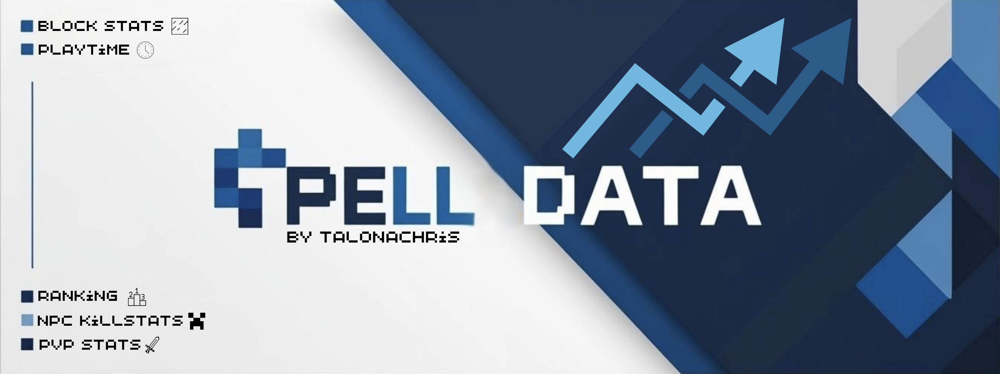

# PellData – Spigot 1.21.5 Statistics Plugin


---

## 🇬🇧 English

---

### ✨ Features
- **Custom localisation (`custom.yml`)** – Use `language: custom` in `config.yml` for your own translation.
- **Fully stylised messages** – Colored and formatted output for all commands.
- **Dynamic placeholders** – Uniform use of `{prefix}`, `{rank}`, `{value}`, `{name}`, etc.
- **Block statistics** – placed & broken blocks with global top lists.
- **Mob & PvP kills** – separate counters with top mob types.
- **Deaths** – tracks player deaths.
- **Playtime (AFK filter)** – adds 5 s every 5 s while player is active (≤ 10 min idle).
- **Chat messages** – counts chat lines written.
- **Global stats** – `/pelldata globalstats` shows server-wide stats.
- **Rankings** – `/pelldata ranking` opens interactive GUI.
- **Visual GUI Menu** – Fully translated inventory interface `/pelldata stats` with clickable categories and back buttons.
- **PlaceholderAPI** – personal, global & per‑player placeholders.
- **Localisation** – via `locales/en_us.yml`, `de_de.yml`, ...

---

### 🚀 Installation
1. Download the JAR from **Releases**.  
2. Drop it into the **`/plugins`** folder.  
3. *(Important!)* Install [PlaceholderAPI](https://www.spigotmc.org/resources/placeholderapi.6245/).  
4. Start the server – PellData will create its files.

---

### ⚙️ Configuration
```yml
# plugins/PellData/config.yml
# Set your language and backup settings
language: en_us   # en_us | de_de | custom
backup:
  interval_minutes: 5   # Backup every X minutes
```

---

### 🔹 Commands
| Command | Description |
|---------|-------------|
| `/pelldata stats` | Open your personal statistics GUI |
| `/pelldata globalstats` | View combined global statistics |
| `/pelldata ranking` | Opens the global Top-10 ranking menu |

---

### 📚 PlaceholderAPI Variables

**Personal**
```
%pelldata_blocks_placed%
%pelldata_blocks_broken%
%pelldata_killed_mobs%
%pelldata_deaths%
%pelldata_playtime%
%pelldata_chat%
%pelldata_pvp%
```

**Global**
```
%pelldata_global_blocks_placed%
%pelldata_global_blocks_broken%
%pelldata_global_killed_mobs%
%pelldata_global_deaths%
%pelldata_global_playtime%
%pelldata_global_chat%
%pelldata_global_pvp%
```

---

### 🌐 Localisation
English (`en_us.yml`) is loaded by default.  
To translate PellData, copy the file as `de_de.yml` or `custom.yml` and modify texts – keep color codes and placeholders.

---

### 💾 Backup Feature

- Backups are automatically created every X minutes.
- The backup file is named `data_backup.db` and stored in the plugin folder.
- You can configure the interval in `config.yml` with `backup.interval_minutes`.

---

## 🇩🇪 Deutsch

---

### ✨ Funktionen
- **Eigene Lokalisierung (`custom.yml`)** – Verwende `language: custom` in der `config.yml`.
- **Vollständig formatierte Ausgaben** – Farbige & strukturierte Texte für alle Befehle.
- **Dynamische Platzhalter** – Einheitlich wie `{prefix}`, `{value}`, `{name}` etc.
- **Blockstatistiken** – gesetzte & abgebaute Blöcke mit globalen Toplisten.
- **Mob- & PvP-Kills** – mit getrennten Zählern & Top-Mob-Typen.
- **Tode** – erfasst Spielertode.
- **Spielzeit (AFK-Filter)** – zählt nur, wenn Spieler ≤ 10 Min. aktiv ist.
- **Chatnachrichten** – zählt geschriebene Zeilen.
- **Globale Statistiken** – `/pelldata globalstats` zeigt die Gesamtdaten.
- **Ranglisten-Menü** – `/pelldata ranking` öffnet interaktive GUI.
- **Visuelles Menü** – `/pelldata stats` zeigt alle Kategorien & Rankings per Klick – mit Zurück-Button.
- **PlaceholderAPI** – Platzhalter für persönliche, globale & Spielerwerte.
- **Lokalisierung** – über `locales/en_us.yml`, `de_de.yml`, …

---

### 🚀 Installation
1. JAR aus den **Releases** herunterladen  
2. In **`/plugins`** einfügen  
3. *(Wichtig!)* [PlaceholderAPI](https://www.spigotmc.org/resources/placeholderapi.6245/) installieren  
4. Server starten – PellData erzeugt die Dateien

---

### ⚙️ Konfiguration
```yml
# plugins/PellData/config.yml
# Set your language and backup settings
language: de_de   # de_de | en_us | custom
backup:
  interval_minutes: 5   # Backup alle X Minuten
```

---

### 🔹 Befehle
| Befehl | Beschreibung |
|--------|--------------|
| `/pelldata stats` | Öffnet deine Statistik-GUI |
| `/pelldata globalstats` | Zeigt globale Gesamtstatistiken |
| `/pelldata ranking` | Öffnet das globale Top-Ranking-Menü |

---

### 📚 PlaceholderAPI‑Variablen

**Eigene Werte**
```
%pelldata_blocks_placed%
%pelldata_blocks_broken%
%pelldata_killed_mobs%
%pelldata_deaths%
%pelldata_playtime%
%pelldata_chat%
%pelldata_pvp%
```

**Globale Werte**
```
%pelldata_global_blocks_placed%
%pelldata_global_blocks_broken%
%pelldata_global_killed_mobs%
%pelldata_global_deaths%
%pelldata_global_playtime%
%pelldata_global_chat%
%pelldata_global_pvp%
```

---

### 🌐 Lokalisierung
Die englische Datei (`en_us.yml`) wird standardmäßig geladen.  
Du kannst sie kopieren (z. B. als `de_de.yml` oder `custom.yml`) und übersetzen – Farbcodes und Platzhalter **nicht verändern**.

---

### 💾 Backup-Funktion

- Backups werden automatisch alle X Minuten erstellt.
- Die Backup-Datei heißt `data_backup.db` und liegt im Plugin-Ordner.
- Das Intervall kann in der `config.yml` über `backup.interval_minutes` eingestellt werden.
